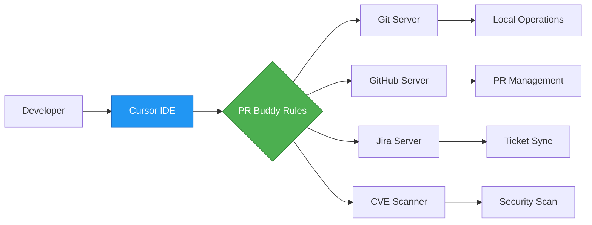

# 🚀 PR Buddy - AI-Powered Pull Request Assistant

<div align="center">
  
  
  
  
</div>

## 📑 Table of Contents

- [🎯 Overview](#-overview)
- [✨ Key Features](#-key-features)
- [📁 Repository Structure](#-repository-structure)
- [🚀 Quick Start](#-quick-start)
- [📖 Documentation](#-documentation)
- [💡 Usage Examples](#-usage-examples)
- [🤝 Contributing](#-contributing)
- [📄 License](#-license)

## 🎯 Overview

**PR Buddy** is an advanced AI-powered pull request management system that seamlessly integrates with your development workflow through the Model Context Protocol (MCP). It combines four powerful MCP servers with intelligent AI rules to automate and enhance your PR lifecycle - from creation through review to merging.

### What Makes PR Buddy Special?

- **🤖 AI-Driven Automation** - Intelligent PR creation, review, and updates using Cursor's AI agents
- **🔒 Security-First** - Built-in CVE scanning and vulnerability detection
- **🔗 Full Integration** - Seamless GitHub, Git, Jira, and security tool integration
- **⚡ Zero Context Switching** - Everything happens within your IDE

## ✨ Key Features

| Feature                   | Description                                                                         |
| ------------------------- | ----------------------------------------------------------------------------------- |
| **Smart PR Creation**     | Automatically generates PR descriptions, links Jira tickets, and validates changes  |
| **Comprehensive Reviews** | AI-powered code review with bug detection, security scanning, and compliance checks |
| **Safe Updates**          | Intelligent PR modifications that preserve important information                    |
| **CVE Scanning**          | Real-time vulnerability detection in dependencies and code                          |
| **Jira Integration**      | Automatic ticket linking, requirement verification, and status updates              |
| **GitHub Actions**        | Workflow management, CI/CD integration, and automated testing                       |

## 📁 Repository Structure

```
pr-buddy/
├── README.md                    # You are here!
├── setup_pr_buddy.sh           # One-click installation script
├── docs/                       # Detailed documentation
│   ├── PREREQUISITES.md        # System requirements & tools
│   ├── SETUP_GITHUB.md        # GitHub token setup guide
│   ├── SETUP_JIRA.md          # Jira integration guide
│   └── TROUBLESHOOTING.md     # Common issues & solutions
├── rules/                      # AI agent rules for Cursor
│   ├── pr-creation.mdc        # PR creation assistant
│   ├── pr-review.mdc          # PR review assistant
│   └── pr-update.mdc          # PR update assistant
└── servers/                    # MCP servers (git submodules)
    ├── cve-search/            # CVE vulnerability scanner
    ├── git/                   # Git operations server
    ├── github-mcp-server/     # GitHub integration
    └── jira-mcp/             # Jira integration
```

## 🚀 Quick Start

### Prerequisites

Before starting, ensure you have:

- ✅ Python 3.10+
- ✅ Git
- ✅ Cursor IDE (latest version)
- ✅ Go 1.21+ or Docker (for GitHub server)

👉 **[Detailed Prerequisites Guide](docs/PREREQUISITES.md)**

### Installation

```bash
# 1. Clone the repository with submodules
git clone --recursive https://github.com/YOUR_USERNAME/pr-buddy.git
cd pr-buddy

# 2. Run the interactive setup script
./setup_pr_buddy.sh

# 3. Copy the generated configuration to Cursor
cp ~/.pr-buddy/mcp.json ~/.cursor/mcp.json

# 4. Restart Cursor and enable Agent Mode
```

The setup script will:

- ✅ Check all system requirements
- ✅ Install missing dependencies
- ✅ Configure all MCP servers
- ✅ Set up authentication tokens
- ✅ Install AI rules globally
- ✅ Test your connections

## 📖 Documentation

### Setup Guides

| Guide                                             | Description                                                   |
| ------------------------------------------------- | ------------------------------------------------------------- |
| **[📋 Prerequisites](docs/PREREQUISITES.md)**     | System requirements, tool installation, and environment setup |
| **[🔐 GitHub Setup](docs/SETUP_GITHUB.md)**       | Creating and configuring GitHub Personal Access Tokens        |
| **[🎫 Jira Setup](docs/SETUP_JIRA.md)**           | Setting up Jira API tokens and integration                    |
| **[🔧 Troubleshooting](docs/TROUBLESHOOTING.md)** | Solutions for common issues and debugging tips                |

### Quick References

| Document                                      | Description                           |
| --------------------------------------------- | ------------------------------------- |
| **[📜 Quick Reference](QUICK_REFERENCE.md)**  | Command cheat sheet and shortcuts     |
| **[🏗️ Architecture](docs/ARCHITECTURE.md)**   | Detailed system design and diagrams   |
| **[📝 ASCII Diagrams](docs/ARCHITECTURE.md)** | Architecture diagrams in ASCII format |
| **[🤝 Contributing](CONTRIBUTING.md)**        | How to contribute to PR Buddy         |

## 💡 Usage Examples

### Creating a Pull Request

```markdown
@pr-creation.mdc Create a PR for the authentication feature on master branch.
The changes are in feature/auth-oauth branch. This addresses Jira ticket DSE-1234.
```

### Reviewing a Pull Request

```markdown
@pr-review.mdc Review PR Sense/cloudera-sense/789 thoroughly.
Check for security vulnerabilities, bugs, and Jira compliance.
```

### Updating a Pull Request

```markdown
@pr-update.mdc Update PR Sense/cloudera-sense/456 description
with the latest Jira requirements while preserving test evidence.
```

### Quick Commands

| Command            | Description                    |
| ------------------ | ------------------------------ |
| `@pr-creation.mdc` | Activate PR creation assistant |
| `@pr-review.mdc`   | Activate PR review assistant   |
| `@pr-update.mdc`   | Activate PR update assistant   |

## 🎮 How PR Buddy Works



## 🔧 Advanced Configuration

### Customizing for Your Workflow

1. **Global Rules** (for all projects):

   ```bash
   cp rules/*.mdc ~/.cursor/rules/
   ```

2. **Project-Specific Rules**:

```bash
   mkdir -p .cursor/rules
   cp /path/to/pr-buddy/rules/*.mdc .cursor/rules/
```

3. **Custom Toolsets** (optimize performance):

```json
{
  "env": {
    "GITHUB_TOOLSETS": "repos,pull_requests,issues"
  }
}
```

### Security Best Practices

- 🔐 Use environment variables for tokens
- 🔄 Rotate tokens every 90 days
- 🛡️ Use fine-grained GitHub tokens
- 📝 Enable audit logging

## 🐛 Getting Help

### Quick Fixes

- **MCP servers not starting?** → Check [Troubleshooting Guide](docs/TROUBLESHOOTING.md#mcp-server-issues)
- **Authentication failing?** → Review [GitHub Setup](docs/SETUP_GITHUB.md) or [Jira Setup](docs/SETUP_JIRA.md)
- **Rules not working?** → See [Troubleshooting Guide](docs/TROUBLESHOOTING.md#cursor-integration-issues)

### Support Channels

- 📝 [GitHub Issues](https://github.com/YOUR_USERNAME/pr-buddy/issues) - Bug reports and feature requests
- 💬 [Discussions](https://github.com/YOUR_USERNAME/pr-buddy/discussions) - Questions and community help
- 📧 Email: support@pr-buddy.dev

## 🤝 Contributing

We welcome contributions! Please see our [Contributing Guide](CONTRIBUTING.md) for:

- Code of conduct
- Development setup
- Submission guidelines
- Coding standards

## 📄 License

PR Buddy is licensed under the MIT License. See [LICENSE](LICENSE) for details.

## 🙏 Acknowledgments

- **Model Context Protocol** team for the MCP framework
- **Cursor** team for the amazing IDE integration
- **GitHub**, **Atlassian**, and **CIRCL** for their APIs
- All contributors and users of PR Buddy

---

<div align="center">
  <b>Built with ❤️ for developers who value quality and efficiency</b>
  <br>
  <i>PR Buddy - Your AI-powered pull request companion</i>
</div>
