# 🚀 PR Buddy - AI-Powered Pull Request Assistant

<div align="center">
  
  
  
  
</div>

## 🎯 Overview

**PR Buddy** is an advanced AI-powered pull request management system that seamlessly integrates with your development workflow through the Model Context Protocol (MCP). It combines four powerful MCP servers with intelligent AI rules to automate and enhance your PR lifecycle - from creation through review to merging.

### 📁 Repository Structure

```
pr-buddy/
├── README.md                    # Main documentation
├── QUICK_REFERENCE.md          # Command reference guide
├── CONTRIBUTING.md             # Contribution guidelines
├── ARCHITECTURE_ASCII.md       # ASCII diagrams for local viewing
├── setup_pr_buddy.sh          # Automated setup script
├── .gitmodules                # Submodule configuration
├── rules/                     # AI rules for Cursor
│   ├── pr-creation.mdc       # PR creation assistant rule
│   ├── pr-review.mdc         # PR review assistant rule
│   └── pr-update.mdc         # PR update assistant rule
└── servers/                   # MCP servers (git submodules)
    ├── cve-search/           # CVE vulnerability scanner (GitHub)
    ├── git/                  # Git operations server (GitHub)
    ├── github-mcp-server/    # GitHub integration server (GitHub)
    └── jira-mcp/            # Jira integration server (GitHub)
```

> **Note:** The servers are linked as git submodules, allowing independent updates while maintaining a cohesive PR Buddy system.

### ✨ Key Features

- **🤖 AI-Driven PR Automation** - Intelligent PR creation, review, and updates
- **🔒 Security-First Approach** - Built-in CVE scanning and vulnerability detection
- **🔗 Full Integration** - Seamless GitHub, Git, Jira, and security tool integration
- **⚡ Cursor Optimized** - Specially designed for Cursor IDE with AI agents
- **📊 Comprehensive Analysis** - Deep code review with actionable insights

## 🏗️ Architecture

> **📌 Note:** To view diagrams in VSCode, install the [Markdown Preview Mermaid Support](https://marketplace.visualstudio.com/items?itemName=bierner.markdown-mermaid) extension or view this file on GitHub.


## 📖 Viewing This Documentation

### For Best Experience

This README contains Mermaid diagrams. To view them properly:

**Option 1: VSCode Extensions (Recommended)**

```bash
# Quick setup - installs all recommended extensions
./vscode_setup.sh

# Or install just Mermaid support
code --install-extension bierner.markdown-mermaid
# Or search for "Markdown Preview Mermaid Support" in Extensions (Cmd+Shift+X)
```

- Alternative: [Markdown Preview Enhanced](https://marketplace.visualstudio.com/items?itemName=shd101wyy.markdown-preview-enhanced)
- Then use `Cmd+Shift+V` (Mac) or `Ctrl+Shift+V` (Windows/Linux) to preview

**Option 2: GitHub**

- View this file directly on GitHub where Mermaid renders automatically
- [View on GitHub](https://github.com/YOUR_REPO/blob/main/README.md)

**Option 3: ASCII Fallback**

- View [ARCHITECTURE_ASCII.md](ARCHITECTURE_ASCII.md) for ASCII versions of all diagrams
- Works in any text editor without extensions

**Option 4: Other Tools**

- Use [Obsidian](https://obsidian.md/), [Typora](https://typora.io/), or any Markdown editor with Mermaid support
- Copy diagrams to [Mermaid Live Editor](https://mermaid.live/) for interactive viewing

## 📋 Prerequisites

Before setting up PR Buddy, ensure you have:

- **Python 3.10+** installed
- **Git** configured with your credentials
- **Cursor IDE** (latest version with MCP support)
- **Go 1.21+** (recommended for GitHub MCP server local build)
- **Docker** (optional alternative to Go for GitHub server)
- **Access to:**
  - GitHub account with Personal Access Token
  - Jira Cloud instance with API token (optional)
  - Repository permissions for PR operations

> **Note:** The setup script prefers local builds over Docker for better performance and reliability. Docker is only used if explicitly chosen or if Go is not available.

## 🛠️ Complete Setup Guide

### Option 1: Interactive Setup (Recommended) 🚀

Simply run the interactive setup script:

```bash
# Clone the repository with submodules
git clone --recursive https://github.com/YOUR_USERNAME/pr-buddy.git
cd pr-buddy

# Run interactive setup
./setup_pr_buddy.sh
```

The script will:

- ✅ Check all system requirements
- ✅ Install missing dependencies (like UV)
- ✅ Initialize git submodules
- ✅ Install all MCP servers
- ✅ Prompt for configuration (GitHub, Jira)
- ✅ Generate ready-to-use `mcp.json` for Cursor
- ✅ Copy AI rules to Cursor's global rules directory
- ✅ Test your connections
- ✅ Provide clear next steps

### Option 2: Manual Setup

If you prefer manual control, follow these steps:

#### Step 1: Clone and Initialize

```bash
# Clone with submodules
git clone --recursive https://github.com/YOUR_USERNAME/pr-buddy.git
cd pr-buddy

# Or if already cloned
git submodule update --init --recursive
```

#### Step 2: Install Dependencies

```bash
# Install UV package manager
curl -LsSf https://astral.sh/uv/install.sh | sh

# Install each server
cd servers/cve-search && uv sync && cd ../..
cd servers/git && uv sync && cd ../..
cd servers/jira-mcp && uv sync && cd ../..

# For GitHub server (recommended: local build):
# Option A: Build from source (RECOMMENDED - better performance)
cd servers/github-mcp-server
go build -o github-mcp-server cmd/github-mcp-server/main.go
cd ../..

# Option B: Docker (only if Go is not available)
docker pull ghcr.io/github/github-mcp-server
```

#### Step 3: Configure

Create `~/.pr-buddy/.env`:

```bash
# GitHub Configuration
GITHUB_PERSONAL_ACCESS_TOKEN="ghp_your_token_here"
GITHUB_HOST="https://github.com"

# Jira Configuration
JIRA_BASE_URL="https://yourcompany.atlassian.net"
JIRA_EMAIL="your-email@company.com"
JIRA_API_TOKEN="your_jira_api_token"

# Repository
DEFAULT_GIT_REPO="/path/to/your/repo"
```

### Step 4: Configure Cursor

After running the setup script, copy the generated configuration:

```bash
# Copy the generated MCP configuration to Cursor
cp ~/.pr-buddy/mcp.json ~/.cursor/mcp.json

# Or view it first
cat ~/.pr-buddy/mcp.json
```

### Step 5: Install PR Buddy Rules

PR Buddy includes three AI rules that enhance Cursor's Agent Mode:

```bash
# Create Cursor rules directory if it doesn't exist
mkdir -p ~/.cursor/rules

# Copy PR Buddy rules from the repository
cp rules/*.mdc ~/.cursor/rules/

# Or copy them globally (recommended)
cp rules/*.mdc "$HOME/.cursor/rules/"
```

> **Note:** The rules enable intelligent PR creation, review, and update workflows in Cursor's Agent Mode. They are installed globally and will be available for all your projects.

## ✅ Testing Your Setup

After installation, test your configuration:

```bash
# Test connections
~/.pr-buddy/test_connection.sh

# Or manually test each service
curl -H "Authorization: token $GITHUB_PERSONAL_ACCESS_TOKEN" https://api.github.com/user
curl -u "$JIRA_EMAIL:$JIRA_API_TOKEN" "$JIRA_BASE_URL/rest/api/3/myself"
```

## 🎮 Usage Guide

### PR Creation Workflow


### PR Review Workflow


## 📜 Global Rules Management in Cursor

### Understanding Cursor Rules

Cursor supports both **global** and **project-specific** rules:

1. **Global Rules** (`~/.cursor/rules/`)

   - Available across ALL your projects
   - Ideal for PR Buddy rules since you want them everywhere
   - Automatically loaded when Cursor starts
   - No need to copy rules to each repository

2. **Project Rules** (`.cursor/rules/` in project root)
   - Only available in that specific project
   - Override global rules with the same name
   - Useful for project-specific customizations

### Installing PR Buddy Rules Globally (Recommended)

```bash
# One-time global installation
mkdir -p ~/.cursor/rules
cp /path/to/pr-buddy/rules/*.mdc ~/.cursor/rules/

# Verify installation
ls -la ~/.cursor/rules/
# Should show:
# pr-creation.mdc
# pr-review.mdc
# pr-update.mdc
```

### Managing Rules

```bash
# Update rules from PR Buddy repo
cd /path/to/pr-buddy
git pull
cp rules/*.mdc ~/.cursor/rules/

# Backup your rules
cp -r ~/.cursor/rules ~/.cursor/rules.backup

# Remove a specific rule
rm ~/.cursor/rules/pr-update.mdc

# Disable all PR Buddy rules temporarily
mv ~/.cursor/rules ~/.cursor/rules.disabled
```

### Rule Priority & Loading

Cursor loads rules in this order:

1. Project-specific rules (`.cursor/rules/` in workspace)
2. Global rules (`~/.cursor/rules/`)
3. Built-in Cursor rules

> **Tip:** Use global rules for PR Buddy to have them available in all your projects without duplication!

## 💡 Cursor-Specific Features & Tips

### 1. Agent Mode Activation

In Cursor, activate Agent Mode for PR Buddy:

- Open Command Palette: `Cmd+Shift+P` (Mac) or `Ctrl+Shift+P` (Windows/Linux)
- Type: "Toggle Agent Mode"
- Look for the Agent icon in the status bar

### 2. Using PR Buddy Rules

The three AI rules automatically activate based on your intent:

```markdown
# For PR Creation

@pr-creation.mdc "Create a draft PR on master branch for my recent changes related to authentication feature"

# For PR Review

@pr-review.mdc "Review PR Sense/cloudera-sense/123 for security issues and bugs"

# For PR Update

@pr-update.mdc "Update PR Sense/cloudera-sense/456 description with latest Jira requirements"
```

### 3. Custom Commands & Shortcuts

Add to your Cursor keybindings (`keybindings.json`):

```json
[
  {
    "key": "cmd+shift+p cmd+r",
    "command": "workbench.action.chat.open",
    "args": {
      "query": "@pr-review.mdc Review the current PR for issues"
    }
  },
  {
    "key": "cmd+shift+p cmd+c",
    "command": "workbench.action.chat.open",
    "args": {
      "query": "@pr-creation.mdc Create a PR from my staged changes to master branch"
    }
  }
]
```

### 4. Context Window Optimization

PR Buddy is optimized for Cursor's context window:

- Automatically chunks large PRs for review
- Prioritizes critical findings
- Uses semantic search for relevant code context

### 5. Multi-File Operations

Leverage Cursor's multi-file awareness:

```markdown
@agent "Review all changes in src/ directory for the authentication PR"
```

## 🔧 Advanced Configuration

### Custom Toolsets for GitHub Server

Optimize performance by enabling only needed toolsets:

```json
{
  "pr-buddy-github": {
    "args": ["...", "-e", "GITHUB_TOOLSETS=repos,pull_requests,issues,actions"]
  }
}
```

Available toolsets:

- `context` - User and repository context
- `repos` - Repository operations
- `pull_requests` - PR management
- `issues` - Issue tracking
- `actions` - GitHub Actions
- `code_security` - Security scanning
- `notifications` - Notification management

### Security Best Practices

1. **Token Management**

   ```bash
   # Use environment variables, never hardcode
   export GITHUB_PERSONAL_ACCESS_TOKEN="$(op read op://Personal/GitHub/token)"
   ```

2. **Scope Limitation**

   - Create tokens with minimal required permissions
   - Use separate tokens for different environments
   - Rotate tokens regularly

3. **Branch Protection**
   - PR Buddy respects branch protection rules
   - Prevents direct pushes to master/main
   - Enforces review requirements

## 🐛 Troubleshooting

### Common Issues & Solutions

#### 1. MCP Server Not Starting

```bash
# Check server status
curl http://localhost:3000/health

# Verify installations
uv --version
docker --version
python --version

# Test individual servers
uv run --directory servers/cve-search python test_server.py
```

#### 2. Authentication Failures

```bash
# Test GitHub token
curl -H "Authorization: token $GITHUB_PERSONAL_ACCESS_TOKEN" \
  https://api.github.com/user

# Test Jira connection
curl -u $JIRA_EMAIL:$JIRA_API_TOKEN \
  $JIRA_BASE_URL/rest/api/3/myself
```

#### 3. Cursor Integration Issues

```bash
# Check MCP logs
tail -f ~/Library/Logs/Cursor/mcp*.log

# Restart MCP servers
killall -9 python
killall -9 docker

# Clear Cursor cache
rm -rf ~/Library/Caches/Cursor/
```

### Debug Mode

Enable verbose logging:

```json
{
  "mcpServers": {
    "pr-buddy-git": {
      "env": {
        "MCP_LOG_LEVEL": "DEBUG",
        "PYTHONPATH": "."
      }
    }
  }
}
```

## 📊 Performance Optimization

### Resource Management

```mermaid
graph LR
    subgraph "Resource Allocation"
        CPU["CPU Usage<br/>• CVE: Low<br/>• Git: Low<br/>• GitHub: Medium<br/>• Jira: Low"]
        MEM["Memory<br/>• CVE: 100MB<br/>• Git: 50MB<br/>• GitHub: 200MB<br/>• Jira: 100MB"]
        NET["Network<br/>• CVE: API calls<br/>• Git: Local only<br/>• GitHub: REST API<br/>• Jira: REST API"]
    end
```



### Optimization Tips

1. **Batch Operations**

   - Group multiple PR operations
   - Use parallel processing where possible

2. **Caching Strategy**

   - CVE results cached for 24 hours
   - Jira ticket data cached per session
   - GitHub metadata refreshed on demand

3. **Connection Pooling**
   - HTTP connections reused
   - Database connections pooled
   - WebSocket connections maintained

## 📦 Managing Submodules

### Update All Submodules

```bash
# Pull latest changes for all servers
git submodule update --remote --merge

# Or update a specific server
git submodule update --remote servers/cve-search
```

### Work with Individual Servers

```bash
# Navigate to a server
cd servers/git

# Make changes and commit
git add .
git commit -m "Update Git server"
git push

# Return to main repo and update reference
cd ../..
git add servers/git
git commit -m "Update Git server submodule reference"
```

### Clone for Development

```bash
# Clone with all submodules
git clone --recursive https://github.com/YOUR_USERNAME/pr-buddy.git

# Or if already cloned
git submodule init
git submodule update
```

## 🚀 Quick Start Examples

### Example 1: Create PR with Full Context

```markdown
@pr-creation.mdc Create a PR for the authentication feature on master branch. The changes are in the feature/auth-oauth branch. This addresses Jira ticket DSE-1234.
```

### Example 2: Comprehensive PR Review

```markdown
@pr-review.mdc Review PR Sense/cloudera-sense/789 thoroughly. Check for security vulnerabilities, bugs, performance issues, and Jira compliance. Focus especially on the authentication logic.
```

### Example 3: Update PR with Latest Requirements

```markdown
@pr-update.mdc Update PR Sense/cloudera-sense/456 description based on the latest Jira requirements. Preserve the existing test evidence but enhance the description with missing acceptance criteria.
```

## 📚 Additional Resources

### Documentation

- [MCP Protocol Specification](https://modelcontextprotocol.io)
- [Cursor AI Documentation](https://docs.cursor.com)
- [GitHub API Documentation](https://docs.github.com/en/rest)
- [Jira REST API](https://developer.atlassian.com/cloud/jira/platform/rest/v3/)

### Tutorials

- [Creating Your First PR with PR Buddy](docs/tutorials/first-pr.md)
- [Advanced Review Techniques](docs/tutorials/advanced-review.md)
- [Customizing AI Rules](docs/tutorials/custom-rules.md)

## 🤝 Contributing

We welcome contributions! Please see [CONTRIBUTING.md](CONTRIBUTING.md) for guidelines.

## 📄 License

PR Buddy is licensed under the MIT License. See [LICENSE](LICENSE) for details.

## 🙏 Acknowledgments

- **Model Context Protocol** team for the MCP framework
- **Cursor** team for the amazing IDE integration
- **GitHub**, **Atlassian**, and **CIRCL** for their APIs
- All contributors and users of PR Buddy

---

<div align="center">
  <b>Built with ❤️ for developers who value quality and efficiency</b>
  <br>
  <i>PR Buddy - Your AI-powered pull request companion</i>
</div>
