# 🏗️ PR Buddy Architecture

This document provides a comprehensive overview of PR Buddy's architecture, components, and workflows.

## Table of Contents

- [System Overview](#system-overview)
- [Component Architecture](#component-architecture)
- [Workflow Diagrams](#workflow-diagrams)
- [MCP Server Details](#mcp-server-details)
- [Data Flow](#data-flow)
- [Security Architecture](#security-architecture)
- [Performance Considerations](#performance-considerations)

## System Overview

PR Buddy is built on the Model Context Protocol (MCP) architecture, integrating multiple specialized servers with AI-powered rules to create a comprehensive PR management system.

### High-Level Architecture

## Component Architecture

### Core Components

## Workflow Diagrams

### PR Creation Workflow

### PR Review Workflow

### PR Update Workflow

## MCP Server Details

### Server Specifications

```mermaid
graph TB
    subgraph "Git Server"
        GIT_LANG["Language: Python"]
        GIT_PROTO["Protocol: MCP/stdio"]
        GIT_OPS["Operations:<br/>• status<br/>• diff<br/>• commit<br/>• branch<br/>• log"]
    end

    subgraph "GitHub Server"
        GH_LANG["Language: Go"]
        GH_PROTO["Protocol: MCP/stdio"]
        GH_OPS["Operations:<br/>• PR CRUD<br/>• Issues<br/>• Actions<br/>• Reviews<br/>• Files"]
    end

    subgraph "Jira Server"
        JIRA_LANG["Language: Python"]
        JIRA_PROTO["Protocol: MCP/stdio"]
        JIRA_OPS["Operations:<br/>• Get issues<br/>• Search JQL<br/>• Comments<br/>• Transitions"]
    end

    subgraph "CVE Server"
        CVE_LANG["Language: Python"]
        CVE_PROTO["Protocol: MCP/stdio"]
        CVE_OPS["Operations:<br/>• Search CVE<br/>• Scan deps<br/>• Risk score<br/>• Alerts"]
    end
```

### Server Communication

Each MCP server communicates through:

- **Protocol**: JSON-RPC over stdio
- **Transport**: Process pipes
- **Encoding**: UTF-8
- **Message Format**: MCP standard

## Data Flow

### Request Processing Pipeline

### State Management

## Security Architecture

### Authentication Flow

### Security Layers

1. **Transport Security**

   - HTTPS for all external API calls
   - Local process isolation for MCP servers

2. **Authentication**

   - Personal Access Tokens (PAT) for GitHub
   - API tokens for Jira
   - No credentials in code or logs

3. **Authorization**

   - Respect repository permissions
   - Follow Jira project access controls
   - Minimal permission principle

4. **Data Protection**
   - Sensitive data masked in logs
   - Temporary files cleaned up
   - No persistent storage of secrets

## Performance Considerations

### Resource Allocation

```mermaid
graph LR
    subgraph "Resource Usage"
        CPU["CPU Usage<br/>• CVE: Low<br/>• Git: Low<br/>• GitHub: Medium<br/>• Jira: Low"]
        MEM["Memory<br/>• CVE: 100MB<br/>• Git: 50MB<br/>• GitHub: 200MB<br/>• Jira: 100MB"]
        NET["Network<br/>• CVE: API calls<br/>• Git: Local only<br/>• GitHub: REST/GraphQL<br/>• Jira: REST API"]
    end
```

### Optimization Strategies

1. **Parallel Processing**

   - Multiple MCP servers run concurrently
   - Async API calls where possible
   - Non-blocking UI operations

2. **Caching**

   - CVE results cached for 24 hours
   - Jira ticket data cached per session
   - GitHub metadata refreshed on demand

3. **Connection Pooling**

   - HTTP connection reuse
   - Persistent MCP server processes
   - Efficient stdio communication

4. **Selective Loading**
   - Load only required GitHub toolsets
   - Lazy initialization of servers
   - On-demand rule activation

### Performance Metrics

| Component              | Startup Time | Memory Usage | CPU Usage |
| ---------------------- | ------------ | ------------ | --------- |
| Git Server             | < 1s         | ~50MB        | Low       |
| GitHub Server (Go)     | < 2s         | ~200MB       | Medium    |
| GitHub Server (Docker) | 3-5s         | ~300MB       | Medium    |
| Jira Server            | < 1s         | ~100MB       | Low       |
| CVE Server             | < 2s         | ~100MB       | Low       |

## Scalability

### Horizontal Scaling

PR Buddy can scale through:

- Multiple concurrent PR operations
- Parallel server instances
- Distributed team usage

### Vertical Scaling

Performance improves with:

- More CPU cores (parallel processing)
- Additional RAM (larger PR handling)
- SSD storage (faster Git operations)

## Future Architecture Considerations

### Planned Enhancements

1. **WebSocket Support**

   - Real-time PR updates
   - Live collaboration features
   - Streaming logs

2. **Plugin Architecture**

   - Custom rule development
   - Third-party integrations
   - Extended server support

3. **Cloud Integration**

   - Remote server hosting
   - Shared configuration
   - Team synchronization

4. **AI Model Integration**
   - Local LLM support
   - Custom model fine-tuning
   - Enhanced code analysis

## Technical Stack

### Languages & Frameworks

- **Python 3.10+**: CVE, Git, and Jira servers
- **Go 1.21+**: GitHub server
- **TypeScript**: Cursor integration
- **JSON-RPC**: MCP communication

### Dependencies

- **UV**: Python package management
- **Docker**: Optional containerization
- **Git**: Version control operations
- **Cursor IDE**: Host environment

### External APIs

- **GitHub REST API v3**: Repository operations
- **GitHub GraphQL API v4**: Advanced queries
- **Jira REST API v3**: Issue management
- **CVE databases**: Multiple sources (NIST, MITRE, etc.)

## Debugging Architecture

### Logging Hierarchy

### Debug Flow

1. Enable debug mode in MCP config
2. Tail relevant log files
3. Use diagnostic scripts
4. Analyze server responses
5. Check external API status

## Conclusion

PR Buddy's architecture is designed for:

- **Modularity**: Independent, specialized servers
- **Extensibility**: Easy to add new capabilities
- **Reliability**: Fault-tolerant design
- **Performance**: Optimized for developer workflow
- **Security**: Multiple layers of protection

The architecture supports both current needs and future growth, ensuring PR Buddy remains a valuable tool for development teams.
